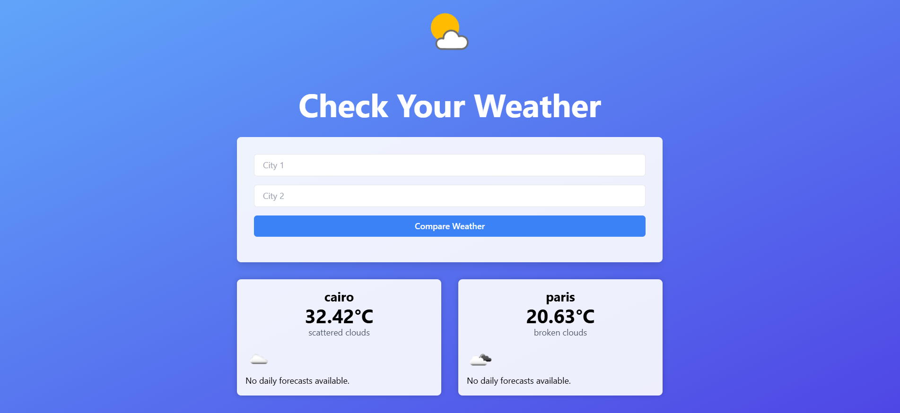

# Weather App

Welcome to the Weather App, a Django-based web application that allows users to check the current weather and forecast for cities using the OpenWeatherMap API.

## Table of Contents

- [Introduction](#introduction)
- [Getting Started](#getting-started)
- [Features](#features)
- [Usage](#usage)
- [Dependencies](#dependencies)
- [Contributing](#contributing)
- [User Interface](#User-Interface)
- [License](#license)

## Introduction

This project is a web-based weather application built with Django, providing users with real-time weather information and forecasts for specified cities. It integrates with the OpenWeatherMap API to fetch accurate weather data.

## Getting Started

1. **Clone the Repository:**
   ```bash
   git clone https://github.com/seifbasel/Weather-App.git
   cd Weather-App
## Usage
1. **Search for Weather:**

Enter the city name in the search bar and click the search button.

2. **View Weather Information:**

See the current temperature, description.

3. **Compare Cities:**
Optionally, compare the weather and forecast for two cities side by side.

## Dependencies

1. **Django**
2. **Requests**

## Contributing
Contributions are welcome! If you have ideas for new features, improvements, or bug fixes, please open an issue or submit a pull request. Your input is valuable.

## User Interface


## License
This project is licensed under the MIT License, allowing for free use, modification, and distribution.
